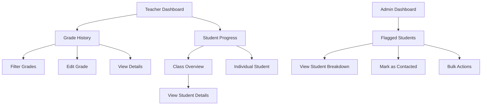

## 1. Product Overview
A comprehensive grade management and student progress tracking system for educational institutions. This platform enables teachers to manage grades efficiently, monitor student progress, and provides administrators with oversight of at-risk students through automated flagging based on low point thresholds.

The system solves the problem of manual grade tracking, provides real-time insights into student performance, and facilitates early intervention for struggling students through systematic flag management and parent communication workflows.

## 2. Core Features

### 2.1 User Roles
| Role | Registration Method | Core Permissions |
|------|---------------------|------------------|
| Teacher | Admin assignment | Manage grades, view student progress, edit grade history |
| Admin | System administrator | View all flagged students, manage parent communications, system oversight |
| Student | Read-only access | View own grades and progress (if enabled) |

### 2.2 Feature Module
Our grade management system consists of the following main pages:
1. **Teacher Main Dashboard**: Overview of teacher's workload, student performance, and flagged students
2. **Teacher Grade History**: Comprehensive grade management with filtering, editing, and retake tracking
3. **Student Progress Dashboard**: Class overview and individual student progress visualization
4. **Admin Flag Dashboard**: Centralized view of at-risk students with action tracking

### 2.3 Page Details
| Page Name | Module Name | Feature description |
|-----------|-------------|---------------------|
| Teacher Main Dashboard | Welcome Header | Greeting, active term, and quick action button |
| Teacher Main Dashboard | Quick Stats | Summary of classes, students, grades entered, and pending actions |
| Teacher Main Dashboard | Flagged Students | Warning section for students requiring attention with action breakdown |
| Teacher Main Dashboard | Class Performance | Performance overview for each class with visual indicators |
| Teacher Main Dashboard | Recent Activity | Table of the last 10 grade entries |
| Teacher Grade History | Filters Section | Select class, term, student, work type, topic/subtopic with apply/clear functionality |
| Teacher Grade History | Grades Data Table | Display all grades with columns for student, course, topic, marks, percentage, LP status, attempt number, date, and actions |
| Teacher Grade History | Edit Grade Dialog | Pre-filled form for modifying grade details with auto-calculation of percentage and LP status |
| Teacher Grade History | Delete Grade | Confirmation dialog with grade details and success toast notification |
| Teacher Grade History | View Grade Details | Expandable row showing full assessment details, notes, and attempt history |
| Teacher Grade History | Retake Management | Display all attempts with highlighting of current attempt and improvement tracking |
| Teacher Grade History | Quick Stats Cards | Show total grades, students with low points, average performance, and pending retakes |
| Student Progress Dashboard | Class Overview | Table showing all students with LP count, flags, average percentage, and status badges |
| Student Progress Dashboard | Individual Progress | Detailed view with performance by topic, grades timeline, retakes, and flagged areas |
| Admin Flag Dashboard | Flagged Students Table | List students with 3+ LP showing flags, action required, and contact status |
| Admin Flag Dashboard | Action Tracking | Mark parent communications as completed with date stamps |
| Admin Flag Dashboard | Bulk Actions | Select multiple students and mark as contacted with CSV export |

## 3. Core Process

### Teacher Flow
Teachers access the system through their dashboard sidebar. From the "View Grades" menu, they can filter and manage all grades they've entered. The grade history page provides comprehensive filtering options to find specific assessments. Teachers can edit existing grades through a dialog interface, delete grades with confirmation, and view detailed grade information including retake history. The system automatically calculates low point (LP) status based on the 80% threshold and tracks multiple attempts for retakes.

### Admin Flow
Administrators access the "Flagged Students" dashboard to monitor at-risk students. The system automatically flags students based on low point accumulation: 3 LP = 1 flag, 4 LP = 2 flags, 5+ LP = 3 flags. Admins can filter by flag level, view detailed breakdowns by subtopic, and track parent communication actions. Bulk operations allow efficient management of multiple flagged students.

### Student Progress Monitoring
Teachers can switch between class overview and individual student views. The class overview shows all students with their flag status, average performance, and quick action indicators. Individual student views provide detailed progress visualization by topic, chronological grade timeline, retake improvement tracking, and identification of critical learning areas requiring intervention.

## 4. User Interface Design

### 4.1 Design Style
- **Primary Colors**: Blue (#2563eb) for primary actions, Green (#16a34a) for passing grades, Red (#dc2626) for low points
- **Secondary Colors**: Gray (#6b7280) for neutral elements, Yellow (#eab308) for warnings, Orange (#ea580c) for critical flags
- **Button Style**: Rounded corners with subtle shadows, primary actions in blue, destructive in red
- **Typography**: Inter font family, 14px base size, clear hierarchy with font weights 400, 500, 600
- **Layout**: Card-based design with consistent spacing, sidebar navigation, and responsive data tables
- **Icons**: Lucide React icons for consistency, flag emojis (🚩) for visual flag indicators

### 4.2 Page Design Overview
| Page Name | Module Name | UI Elements |
|-----------|-------------|-------------|
| Grade History | Filters Section | Horizontal layout with dropdown selectors, apply/clear buttons in blue/gray, responsive grid for mobile |
| Grade History | Data Table | shadcn/ui DataTable with sortable columns, color-coded percentages (red <80%, green ≥80%), badge components for work types |
| Grade History | Edit Dialog | Modal with form fields, read-only student name, editable assessment details, auto-calculating percentage display |
| Student Progress | Class Overview | Card layout with student rows, flag indicators using emoji badges, color-coded status pills |
| Student Progress | Individual View | Tabbed interface for topic performance, timeline visualization, chart components for progress tracking |
| Admin Flags | Dashboard | Alert-style cards for statistics, table with action buttons, bulk selection checkboxes |

### 4.3 Responsiveness
Desktop-first design approach with mobile optimization. Data tables transform to card layouts on mobile devices. Filter sections stack vertically on smaller screens. Touch-optimized buttons with adequate spacing for mobile interaction. Responsive sidebar that collapses to hamburger menu on mobile devices.

### 4.4 Data Visualization
Charts use Recharts library with consistent color schemes. Line charts show grade trends over time with 80% threshold line. Bar charts display topic performance comparisons. Timeline visualization uses chronological markers with color-coded grade indicators. Progress indicators use arrow icons (↗️ ↘️ →) for trend visualization.