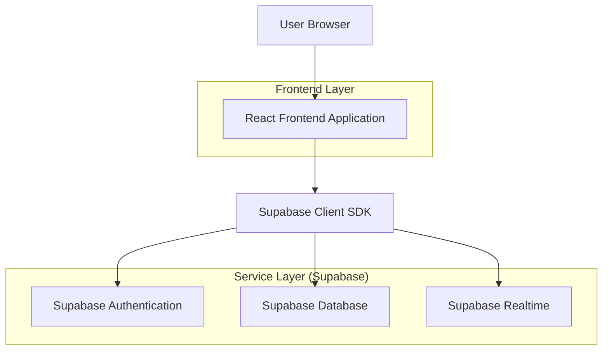
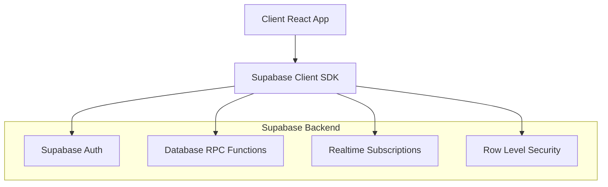
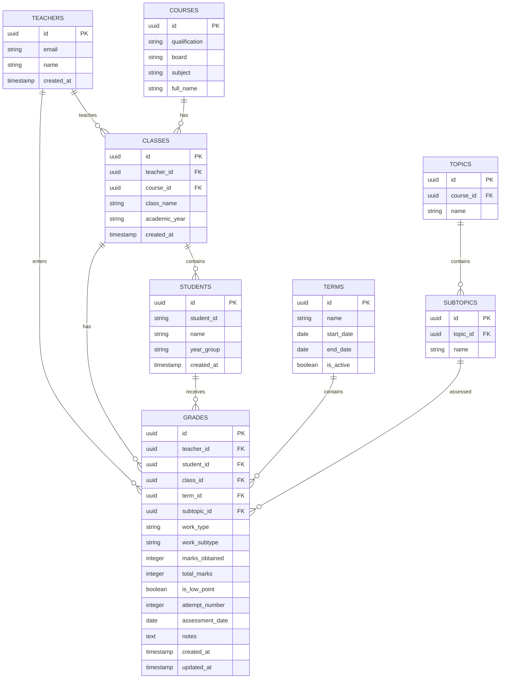

## 1. Architecture Design



## 2. Technology Description

* **Frontend**: React\@18 + TypeScript + TailwindCSS\@3 + Vite

* **Initialization Tool**: vite-init

* **UI Components**: shadcn/ui (Data Table, Card, Badge, Dialog, Tabs, Select, Button, Chart)

* **Backend**: Supabase (Authentication, PostgreSQL, Realtime subscriptions)

* **State Management**: React Context + useReducer for complex state

* **Data Fetching**: TanStack Query for server state management

* **Charts**: Recharts for progress visualization

* **Icons**: Lucide React for consistent iconography

## 3. Route Definitions

| Route                          | Purpose                                         |
| ------------------------------ | ----------------------------------------------- |
| /teacher/dashboard             | Teacher main overview dashboard                 |
| /teacher/grades                | Teacher grade history and management interface  |
| /teacher/progress              | Student progress dashboard with class overview  |
| /teacher/progress/\[studentId] | Individual student detailed progress view       |
| /admin/flags                   | Admin dashboard for flagged students management |
| /api/grades                    | Grade CRUD operations (via Supabase RPC)        |
| /api/progress                  | Student progress calculations and aggregations  |

## 4. API Definitions

### 4.1 Grade Management APIs

**Get Grades with Filters**

```
GET /api/grades
```

Request Parameters:

| Param Name  | Param Type | isRequired | Description                              |
| ----------- | ---------- | ---------- | ---------------------------------------- |
| teacher\_id | string     | true       | UUID of the teacher                      |
| class\_id   | string     | false      | Filter by specific class                 |
| term\_id    | string     | false      | Filter by academic term                  |
| student\_id | string     | false      | Filter by specific student               |
| work\_type  | string     | false      | Filter by work type (classwork/homework) |
| topic\_id   | string     | false      | Filter by topic                          |

Response:

```json
{
  "grades": [
    {
      "id": "grade_uuid",
      "student_name": "John Doe",
      "course": "GCSE - AQA - Mathematics",
      "topic": "Algebra",
      "subtopic": "Linear Equations",
      "work_type": "Classwork",
      "work_subtype": "Worksheet",
      "marks_obtained": 15,
      "total_marks": 20,
      "percentage": 75,
      "is_low_point": true,
      "attempt_number": 1,
      "assessment_date": "2024-01-15",
      "notes": "Needs improvement in equation solving"
    }
  ]
}
```

**Update Grade**

```
PUT /api/grades/[gradeId]
```

Request Body:

```json
{
  "marks_obtained": 18,
  "total_marks": 20,
  "work_type": "Homework",
  "work_subtype": "Past Paper",
  "assessment_date": "2024-01-15",
  "notes": "Improved understanding shown"
}
```

### 4.2 Progress Tracking APIs

**Get Class Progress**

```
GET /api/progress/class/[classId]
```

Response:

```json
{
  "students": [
    {
      "student_id": "student_uuid",
      "student_name": "Jane Smith",
      "year_group": "Year 11",
      "course": "GCSE Mathematics",
      "total_grades": 25,
      "low_points_count": 3,
      "flags": 1,
      "average_percentage": 72.5,
      "status": "At Risk"
    }
  ],
  "class_averages": {
    "average_percentage": 78.2,
    "total_low_points": 15,
    "students_at_risk": 5
  }
}
```

**Get Individual Student Progress**

```
GET /api/progress/student/[studentId]
```

Response:

```json
{
  "student_info": {
    "name": "Jane Smith",
    "year_group": "Year 11",
    "school": "ABC Academy",
    "course": "GCSE Mathematics"
  },
  "overall_stats": {
    "total_grades": 25,
    "total_low_points": 3,
    "flags": 1,
    "average_percentage": 72.5
  },
  "topic_performance": [
    {
      "topic": "Algebra",
      "subtopic": "Linear Equations",
      "assessments_count": 5,
      "best_score": 85,
      "latest_score": 78,
      "average_score": 76,
      "low_points": 1,
      "trend": "stable"
    }
  ],
  "grade_timeline": [
    {
      "date": "2024-01-15",
      "topic": "Algebra",
      "subtopic": "Linear Equations",
      "work_type": "Classwork",
      "marks": "15/20",
      "percentage": 75,
      "is_low_point": true
    }
  ]
}
```

## 5. Server Architecture

Since we're using Supabase as a backend-as-a-service, the server architecture is simplified:



## 6. Data Model

### 6.1 Database Schema



### 6.2 Database Definition Language

```sql
-- Teachers table
CREATE TABLE teachers (
  id UUID PRIMARY KEY DEFAULT gen_random_uuid(),
  email VARCHAR(255) UNIQUE NOT NULL,
  name VARCHAR(255) NOT NULL,
  created_at TIMESTAMP WITH TIME ZONE DEFAULT NOW()
);

-- Classes table
CREATE TABLE classes (
  id UUID PRIMARY KEY DEFAULT gen_random_uuid(),
  teacher_id UUID REFERENCES teachers(id),
  course_id UUID REFERENCES courses(id),
  class_name VARCHAR(255) NOT NULL,
  academic_year VARCHAR(9) NOT NULL,
  created_at TIMESTAMP WITH TIME ZONE DEFAULT NOW()
);

-- Students table
CREATE TABLE students (
  id UUID PRIMARY KEY DEFAULT gen_random_uuid(),
  student_id VARCHAR(50) UNIQUE NOT NULL,
  name VARCHAR(255) NOT NULL,
  year_group VARCHAR(50) NOT NULL,
  created_at TIMESTAMP WITH TIME ZONE DEFAULT NOW()
);

-- Class enrollments (many-to-many relationship)
CREATE TABLE class_enrollments (
  id UUID PRIMARY KEY DEFAULT gen_random_uuid(),
  class_id UUID REFERENCES classes(id),
  student_id UUID REFERENCES students(id),
  enrolled_date DATE DEFAULT CURRENT_DATE,
  UNIQUE(class_id, student_id)
);

-- Terms table
CREATE TABLE terms (
  id UUID PRIMARY KEY DEFAULT gen_random_uuid(),
  name VARCHAR(100) NOT NULL,
  start_date DATE NOT NULL,
  end_date DATE NOT NULL,
  is_active BOOLEAN DEFAULT FALSE
);

-- Courses table
CREATE TABLE courses (
  id UUID PRIMARY KEY DEFAULT gen_random_uuid(),
  qualification VARCHAR(100) NOT NULL,
  board VARCHAR(100) NOT NULL,
  subject VARCHAR(100) NOT NULL,
  full_name VARCHAR(255) NOT NULL
);

-- Topics table
CREATE TABLE topics (
  id UUID PRIMARY KEY DEFAULT gen_random_uuid(),
  course_id UUID REFERENCES courses(id),
  name VARCHAR(255) NOT NULL
);

-- Subtopics table
CREATE TABLE subtopics (
  id UUID PRIMARY KEY DEFAULT gen_random_uuid(),
  topic_id UUID REFERENCES topics(id),
  name VARCHAR(255) NOT NULL
);

-- Grades table (main table)
CREATE TABLE grades (
  id UUID PRIMARY KEY DEFAULT gen_random_uuid(),
  teacher_id UUID REFERENCES teachers(id),
  student_id UUID REFERENCES students(id),
  class_id UUID REFERENCES classes(id),
  term_id UUID REFERENCES terms(id),
  subtopic_id UUID REFERENCES subtopics(id),
  work_type VARCHAR(50) CHECK (work_type IN ('Classwork', 'Homework')),
  work_subtype VARCHAR(50) CHECK (work_subtype IN ('Worksheet', 'Past Paper', 'Quiz', 'Project')),
  marks_obtained INTEGER NOT NULL CHECK (marks_obtained >= 0),
  total_marks INTEGER NOT NULL CHECK (total_marks > 0),
  is_low_point BOOLEAN GENERATED ALWAYS AS (marks_obtained::float / total_marks * 100 < 80) STORED,
  attempt_number INTEGER DEFAULT 1 CHECK (attempt_number >= 1),
  assessment_date DATE NOT NULL,
  notes TEXT,
  created_at TIMESTAMP WITH TIME ZONE DEFAULT NOW(),
  updated_at TIMESTAMP WITH TIME ZONE DEFAULT NOW()
);

-- Create indexes for performance
CREATE INDEX idx_grades_teacher_id ON grades(teacher_id);
CREATE INDEX idx_grades_student_id ON grades(student_id);
CREATE INDEX idx_grades_class_id ON grades(class_id);
CREATE INDEX idx_grades_term_id ON grades(term_id);
CREATE INDEX idx_grades_assessment_date ON grades(assessment_date);
CREATE INDEX idx_grades_is_low_point ON grades(is_low_point);

-- Row Level Security (RLS) policies
ALTER TABLE grades ENABLE ROW LEVEL SECURITY;

-- Teachers can only see their own grades
CREATE POLICY "Teachers can view own grades" ON grades
  FOR SELECT USING (auth.uid() = teacher_id);

-- Teachers can insert their own grades
CREATE POLICY "Teachers can insert own grades" ON grades
  FOR INSERT WITH CHECK (auth.uid() = teacher_id);

-- Teachers can update their own grades
CREATE POLICY "Teachers can update own grades" ON grades
  FOR UPDATE USING (auth.uid() = teacher_id);

-- Teachers can delete their own grades
CREATE POLICY "Teachers can delete own grades" ON grades
  FOR DELETE USING (auth.uid() = teacher_id);

-- Grant permissions
GRANT SELECT ON grades TO authenticated;
GRANT INSERT ON grades TO authenticated;
GRANT UPDATE ON grades TO authenticated;
GRANT DELETE ON grades TO authenticated;
```

### 6.3 Supabase Functions for Calculations

```sql
-- Function to calculate student flags
CREATE OR REPLACE FUNCTION calculate_student_flags(student_id UUID, term_id UUID)
RETURNS TABLE (flag_count INTEGER, action_required TEXT) AS $$
DECLARE
  lp_count INTEGER;
  flags INTEGER;
BEGIN
  SELECT COUNT(*) INTO lp_count
  FROM grades
  WHERE grades.student_id = $1 
    AND grades.term_id = $2 
    AND grades.is_low_point = TRUE;

  flags := CASE
    WHEN lp_count >= 5 THEN 3
    WHEN lp_count = 4 THEN 2
    WHEN lp_count = 3 THEN 1
    ELSE 0
  END;

  RETURN QUERY
  SELECT flags, 
         CASE 
           WHEN flags = 3 THEN 'Meeting Required'
           WHEN flags = 2 THEN 'Call Parents'
           WHEN flags = 1 THEN 'Message Parents'
           ELSE 'On Track'
         END;
END;
$$ LANGUAGE plpgsql;

-- Function to get student progress summary
CREATE OR REPLACE FUNCTION get_student_progress_summary(class_id UUID, term_id UUID)
RETURNS TABLE (
  student_id UUID,
  student_name TEXT,
  total_grades BIGINT,
  low_points BIGINT,
  average_percentage NUMERIC,
  flag_count INTEGER
) AS $$
BEGIN
  RETURN QUERY
  SELECT 
    s.id,
    s.name,
    COUNT(g.id) as total_grades,
    COUNT(g.id) FILTER (WHERE g.is_low_point = TRUE) as low_points,
    ROUND(AVG(g.marks_obtained::float / g.total_marks * 100), 1) as average_percentage,
    (calculate_student_flags(s.id, term_id)).flag_count
  FROM students s
  JOIN class_enrollments ce ON s.id = ce.student_id
  LEFT JOIN grades g ON s.id = g.student_id AND g.term_id = $2
  WHERE ce.class_id = $1
  GROUP BY s.id, s.name;
END;
$$ LANGUAGE plpgsql;
```

